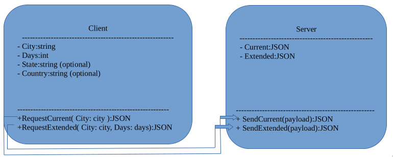

# OpenWeather-gRPC-API

A microservice that accepts remote procedure calls to fetch weather and 
geolocation data. Get current forecasts and 5-day forecasts by city, 
zip code, or exact coordinates, or obtain exact coordinates for a given 
city or zip code.

The service uses [protocol buffers](https://developers.google.com/protocol-buffers/docs/overview)
to define a [gRPC API](https://grpc.io/docs/what-is-grpc/introduction/) that
fetches current and extended weather data. 

Weather and geolocation data is obtained from 
[OpenWeatherMap.org](https://openweathermap.org/api). An API key
that can access the [Current Weather](https://openweathermap.org/current),
[5 day](https://openweathermap.org/forecast5), and 
[Geocoding](https://openweathermap.org/api/geocoding-api) APIs is required. As
of the last update to this README, a free account is sufficient.

### Starting the Server

Before starting the server a file named `.env` must be be added to the 
root directory of the project, or the directory from which you'll execute 
the binary file, with the following fields:

```
API_KEY=xxxxxxxxxxxxxxxx
PORT=xxxxx
```

If you don't want to compile the code or can't use one of the binary releases 
you can run the server with the command `go run server/*.go` from the 
root of the project.

## Sending Requests

### Basic Workflow

1. Generate some server-side code and the code for your preferred language from the files in
the proto directory with the protocol compiler `protoc`.
    - Note that the `protoc-gen-go` and `protoc-gen-go-grpc` plugins must be installed to generate the server-side Go code.
2. Import your newly generated code into your project (Leave the servers code in the proto directory).
3. Use the imported code to allow your client to connect with the server.
4. Use the imported code within your own functions to make requests. It is recommended to review the protocol buffer definitions to get an idea of the types of requests the server will accept. Actual implementation will vary depending on your preferred programming language, however an example in Go is provided below.
    

#### Generating code from the .proto files

Run protoc from the root of the project. The following example shows how one might
generate Go code.

```
protoc -Iproto --go_opt=module=codeberg.org/andcscott/OpenWeather-gRPC-API \
--go_out=. --go-grpc_opt=module=codeberg.org/andcscott/OpenWeather-gRPC-API \
--go-grpc_out=. proto/*.proto
```

#### Importing the code

Import the code into your project. Example in Go:

```
import pb "codeberg.org/andcscott/OpenWeather-gRPC-API/proto"
```

#### Using the imported code to connect to the server

First, enable your client to connect to the server. Example in Go:

```
conn, err := grpc.Dial("localhost:5000", grpc.WithTransportCredentials(insecure.NewCredentials()))
if err != nil {
	log.Fatalln(err)
}
defer conn.Close()

c := pb.NewWeatherServiceClient(conn)
```

See the [test-client](test-client/main.go) for more details.

#### Using the imported code to make requests

In this case, we're requesting the current weather for Corvallis, OR.

```
func doCurrent(c pb.WeatherServiceClient) {

	res, err := c.Current(context.Background(), &pb.RequestCurrent{
		LocationType: pb.LocationType_LOCATION_TYPE_CITY,
		Units:        pb.Units_UNITS_METRIC,
		Location: &pb.OneOfLocation{
			LocationId: &pb.OneOfLocation_City{
				City: "Corvallis",
			},
		},
	})
	if err != nil {
		log.Fatalln(err)
	}

	log.Println(res.Payload)
}
```

See the [test-client](test-client/current.go) for more details.

## Receiving the response

Data will be sent to your client as JSON when requesting forecasts. Geolocation 
requests return a pair of floats representing the latitude and longitude for the
given location. Example from the above call:

```
{"coord":{"lon":-123.262,"lat":44.5646},"weather":[{"id":800,"main":"Clear","description":"clear sky","icon":"01n"}],"base":"stations","main":{"temp":296.87,"feels_like":297.13,"temp_min":294.98,"temp_max":298.62,"pressure":1007,"humidity":70},"visibility":10000,"wind":{"speed":2.14,"deg":284,"gust":1.94},"clouds":{"all":0},"dt":1658811503,"sys":{"type":2,"id":2005452,"country":"US","sunrise":1658753522,"sunset":1658807208},"timezone":-25200,"id":5720727,"name":"Corvallis","cod":200}
```

## UML Sequence Diagram

<a href="./info/UML.png"></a>


