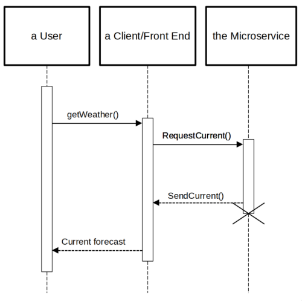

# OpenWeatherMap-gRPC-API

A microservice that accepts remote procedure calls to fetch weather data.

The service uses [protocol buffers](https://developers.google.com/protocol-buffers/docs/overview)
to define a [gRPC API](https://grpc.io/docs/what-is-grpc/introduction/) that
fetches current and extended weather data. 

Weather and geolocation data is obtained from 
[OpenWeatherMap.org](https://openweathermap.org/api). 
At minimum, an API key that can access the the
[Current weather](https://openweathermap.org/current), 
[Daily Forecast 16 Days](https://openweathermap.org/forecast16), and
[Geocoding](https://openweathermap.org/api/geocoding-api) APIs is
required.

Before starting the server a file named `.env` must be be added to the 
root directory of the project, or the directory that contains the binary file, 
with the following fields:

```
API_KEY=xxxxxxxxxxxxxxxx
PORT=xxxxx
```

## Sending Requests

### Basic Workflow

1. Generate the necessary code for your preferred language from the files in
the proto directory with the protoc compiler
    - Note that the `protoc-gen-go` and `protoc-gen-go-grpc` plugins must be installed
2. Import the code into your project
3. Use the imported code to allow your client to connect with the server
4. Use the imported code within your own functions to make requests

#### Generating code from the .proto files

Run protoc from the root of the project. The below example shows how one might
generate Go code.

```
protoc -Iproto --go_opt=module=codeberg.org/andcscott/OpenWeatherMap-gRPC-API \
--go_out=. --go-grpc_opt=module=codeberg.org/andcscott/OpenWeatherMap-gRPC-API \
--go-grpc_out=. proto/*.proto
```

#### Importing the code

Import the code into your project. Example in Go:

```
import pb "codeberg.org/andcscott/OpenWeatherMap-gRPC-API/proto"
```

#### Using the imported code to connect to the server

First, enable your client to connect to the server. Example in Go:

```
conn, err := grpc.Dial("localhost:5000", grpc.WithTransportCredentials(insecure.NewCredentials()))
if err != nil {
	log.Fatalln(err)
}
defer conn.Close()

c := pb.NewWeatherServiceClient(conn)
```

See the [test-client](test-client/main.go) for more details.

#### Using the imported code to make requests

In this case, we're requesting the current weather for Corvallis, OR.

```
func doCurrent(c pb.WeatherServiceClient) {
	res, err := c.Current(context.Background(), &pb.RequestCurrent{
		City: "Corvallis",
	})
	if err != nil {
		log.Fatalln(err)
	}
	log.Println(res.Payload)
}
```

See the [test-client](test-client/current.go) for more details.

## Receiving the response

Data will be sent to your client as JSON when requesting forecasts. Example from the above call:

```
{"coord":{"lon":-123.262,"lat":44.5646},"weather":[{"id":800,"main":"Clear","description":"clear sky","icon":"01n"}],"base":"stations","main":{"temp":296.87,"feels_like":297.13,"temp_min":294.98,"temp_max":298.62,"pressure":1007,"humidity":70},"visibility":10000,"wind":{"speed":2.14,"deg":284,"gust":1.94},"clouds":{"all":0},"dt":1658811503,"sys":{"type":2,"id":2005452,"country":"US","sunrise":1658753522,"sunset":1658807208},"timezone":-25200,"id":5720727,"name":"Corvallis","cod":200}
```

Geolocation requests return a pair of floats representing the latitude and longitude for the given location.

## UML Diagram




